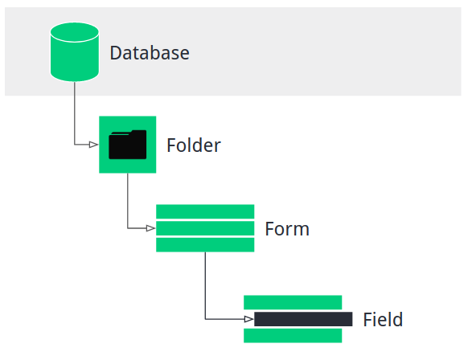

ActivityInfo is a data collection and management platform used in the humanitarian sector, designed particularly for Monitoring & Evaluation. This short tutorial aims to explain how to access data using the ActivityInfo API with R.
<!--MORE-->

ActivityInfo version used for this tutorial is [V4.0](https://v4.activityinfo.org/), focusing on the new interface [(forms, not activities)](http://help.activityinfo.org/m/quick_start_database_design/l/852495-classic-vs-new-interfaces).


## The activityinfo-R package

"Be Data Driven", the company managing ActivityInfo, has developed the ["activityinfo-R"](https://github.com/bedatadriven/activityinfo-R) package. The package conveniently allows R users to read and write data through the ActivityInfo API.

The package can be downloaded from GitHub:

```{r setup, eval=FALSE, include=TRUE}

install.packages("devtools")
library(devtools)
install_github("bedatadriven/activityinfo-R", ref = "release")

```


## Basic Structure

The new ActivityInfo interface uses forms with a look and feel similar to Kobo Toolbox. A database is comprised of forms, which are in turn made up of fields representing the type of data to be collected.

 

(Source: [ActivityInfo](http://help.activityinfo.org/m/quick_start_database_design/l/868870-databases))

Each database, form and field have a unique ID in ActivityInfo. The easiest way to obtain a form ID is by copying it from the URL of a form's table, which follows the structure: 
https://v4.activityinfo.org/app#form/{formID}/table

A database ID is also available from the URL:
https://v4.activityinfo.org/app#database/d{databaseID}
In previous versions, the URL looks like this:
https://www.activityinfo.org/app#design/{databaseID}

Field IDs, on the other hand, can be obtained by reading the JSON file of a form, or by downloading a form schema (see below): 
https://www.activityinfo.org/resources/form/{formID}/schema


## Read ActivityInfo data

Authentication information is needed to access form data. The activityinfo-R package makes this easy through the ActivityInfoLogin function:

```{r eval=FALSE, include=TRUE}
library(activityinfo)
activityInfoLogin("username", "password")


```

This tutorial assumes that you already have a database set up for your organisation. If you have the necessary permissions, you can also create a database directly using the activityinfo-R package (see package Index).

### Accessing all form data
Within your database, the function "getFormRecordTable" allows for the download of all form data in long format:

```{r eval=FALSE, include=TRUE}

df <- getFormRecordTable(form.id = "FormID")

```


In the case of the national coordination platform in Peru (GTRM), we have a simple 3W form to upload partner data:
<br>
<br>
 


To download this data, I can use the formID as shown above:

```{r eval=FALSE, include=TRUE}

df <- getFormRecordTable(form.id = "a2145867380")

```


### Querying within a single form
Through the "queryTable" function, it is also possible to query within a form using field IDs. As mentioned above, you can see field IDs by looking at a form's JSON schema. This can also be accessed directly in R using the "getFormSchema" function.


```{r eval=FALSE, include=TRUE}

df <- getFormSchema("a2145867380")

```

All IDs can be read directly in R:

 

You can then use the field IDs for queries within a form:

```{r eval=FALSE, include=TRUE}

df <- queryTable("formID", columns = c(col1= "FieldID_1", col2="FieldID_2", ...))

```

It is relevant to note that a field can be called also through the Field code, if assigned ("Fieldcode"), or the field label ("[FieldLabel]").

Multiple referenced fields in a form (e.g. dependent dropdowns for admin levels) cannot be downloaded this way, as they are assigned a common field ID. However, queryTable also accepts formulas, so it is possible to include fields on referenced forms using the following notation:

[territory].[name]

This assumes that the form has a reference field named "territory" that refers to a Territory Form. It can also be done across multiple forms:

[territory].[province].[name]


### Download the full database
It is also possible to download the full database contents (across all forms):

```{r eval=FALSE, include=TRUE}

df <- getDatabaseRecordTable(database.id="DatabaseID", as.single.table = FALSE )

```

This will create a list of all forms as data frames.

Should all forms in a database have the same structure, the "as.single.table" argument can be set to TRUE to merge them all in a single table.

## Writing data

### Updating a single record
When downloading a form, you will also obtain all record IDs in that form:

 

You can modify the value of a single record in a form through the function "updateRecord":

```{r eval=FALSE, include=TRUE}

updateRecord(formID, recordID, fieldValues)

```


## Further reading
The activityinfo-R client has a long list of functions that were not covered here. More information is available by researching the package index in R. 

Additional material is available at the following links:

* [ActivityInfo API Documentation](https://www.activityinfo.org/apidocs/index.html)

* [Writing an Expression](http://help.activityinfo.org/m/75865/l/1052332-writing-an-expression)

* Activity Info Client source on [GitHub](https://github.com/bedatadriven/activityinfo-R)

* ActivityInfo API with R [(Webinar)](https://www.gotostage.com/channel/38037f33c0b74793a97a2b8061528f95/recording/fb4d53c6b18a433ba949baf7231577a0/watch?source=CHANNEL)

ActivityInfo [support](<mailto:support@activityinfo.org>) is very quick to respond to any questions on the R ActivityInfo package. A big thanks to Alex Bertram at Be Data Driven, the author of the activityinfo-R package, for his great work and the resources provided.

